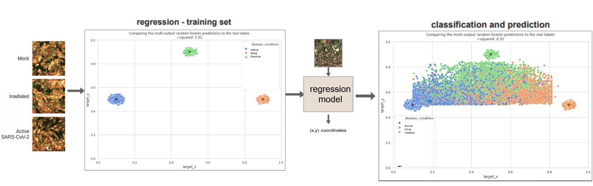

# regression_plane_covid19

There is a need for fast identification of potential treatments for COVID-19 in human cells. We proposed an approach that enables cellular image-based analysis in a supervised manner with no domain knowledge required using the Regression Plane (RP) concept [(Szkalisity et al. 2021)](https://www.nature.com/articles/s41467-021-22866-x). RP is a methodology for modeling and analyzing biological processes using 2-dimensional (2D) regression. Our approach is based on the ideas presented in the original paper by Szkalisity et al., however, we perform naïve modeling of the problem space. The goals of this study are to **identify potential treatments for COVID-19** and **analyze the effect of the treatment’s dosage** on the treated cells. The suggested approach is used to reanalyze a published phenotypic drug discovery dataset to achieve these goals.

